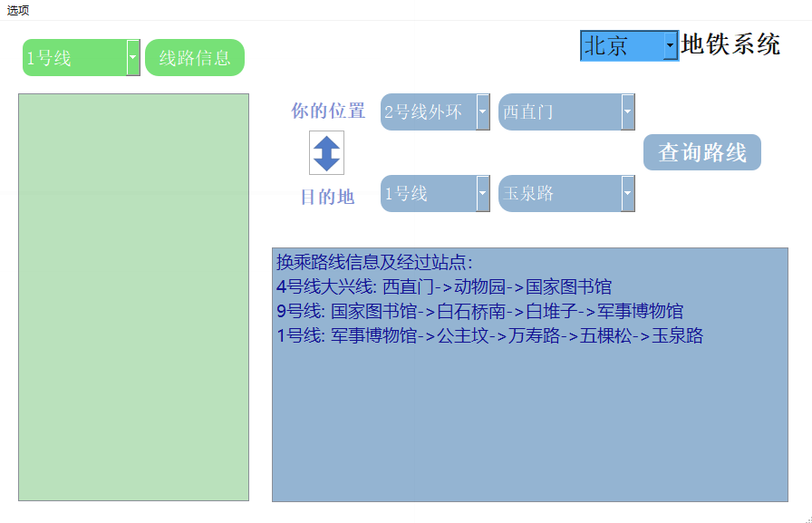
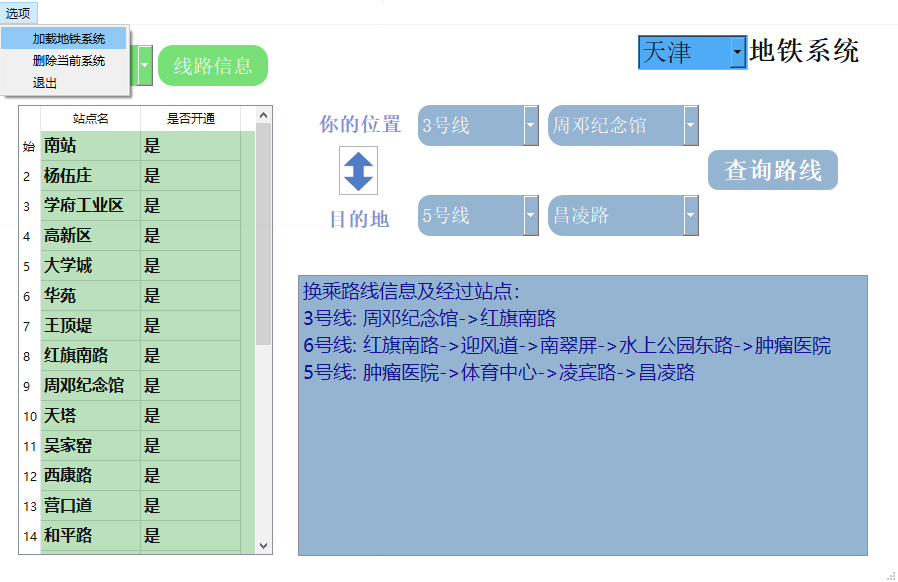

# subwayGo
show the shortest path to destination station by subway(the first project in SE class)  

---
# 运行环境:Python3.7  
第三方库:  
> PyQt5  
> PyQt5-sip 
---

# TO-DO
>- [x] read subway system file by ".csv"  
>- [x] save and load caches by "pickle"  
>- [x] get station information and subway route information  
>- [x] consider how to solve circle route problem  
>- [x] design UI  
>- [x] finished function to show routes information  
>- [x] finished function to show best path to destination  
>- [x] bug fix and optimize  

---

# 介绍

支持从.csv格式导入地铁线路信息,查询地铁站点信息,查询最近距离路线

